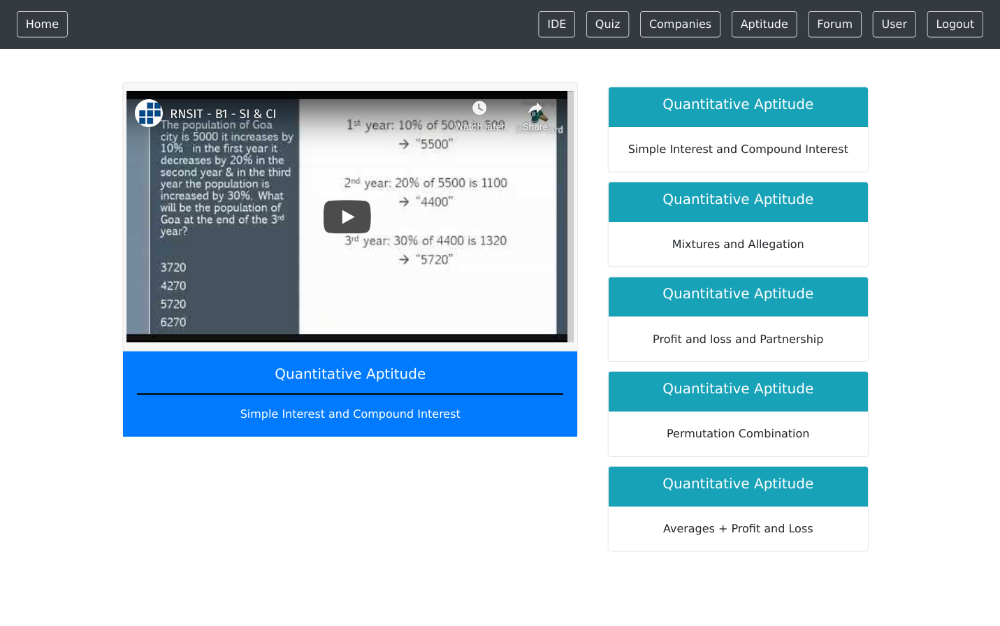
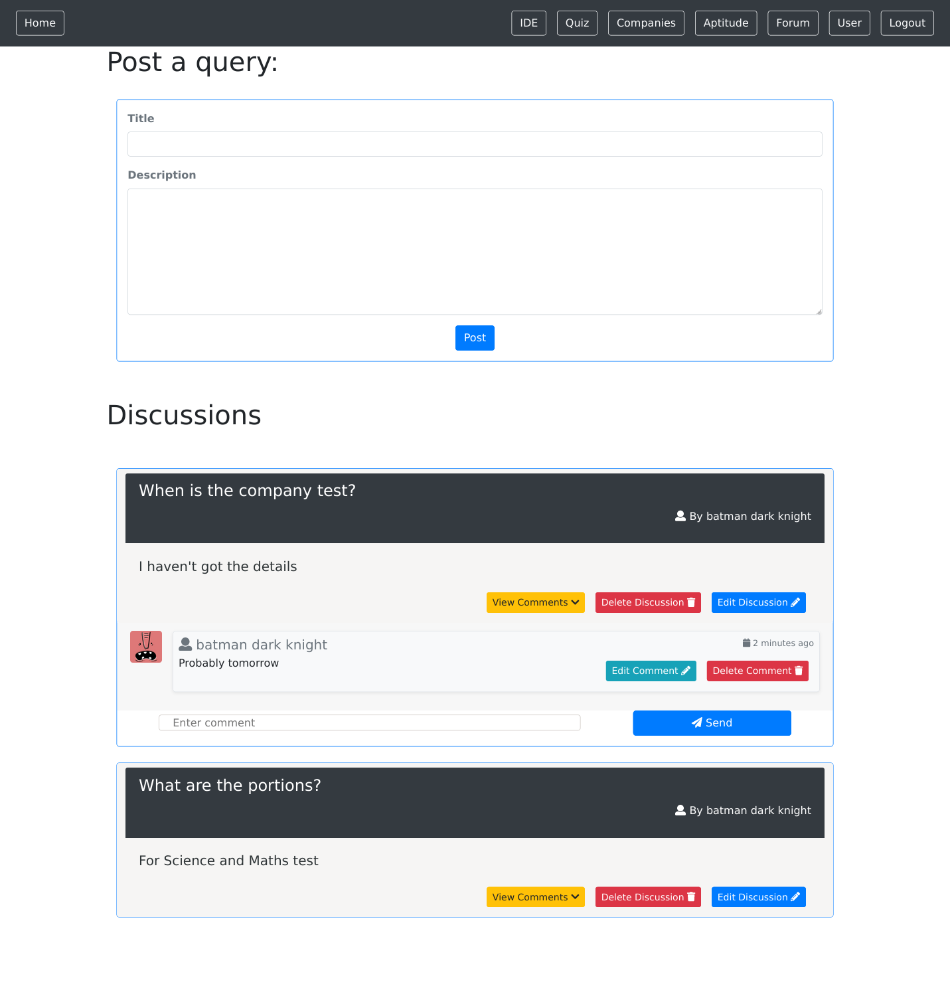
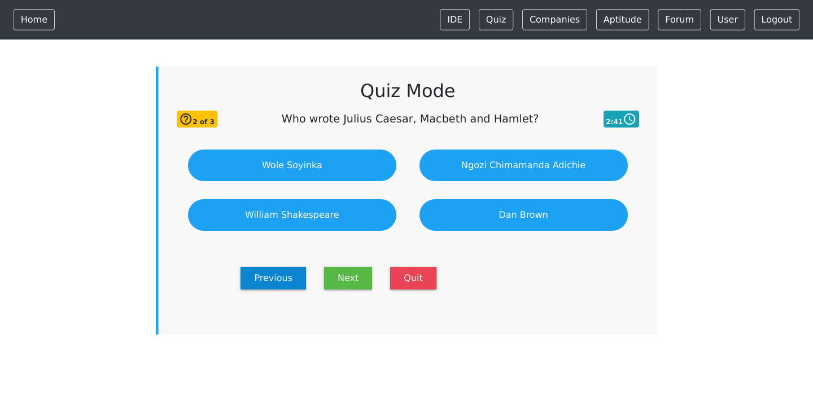
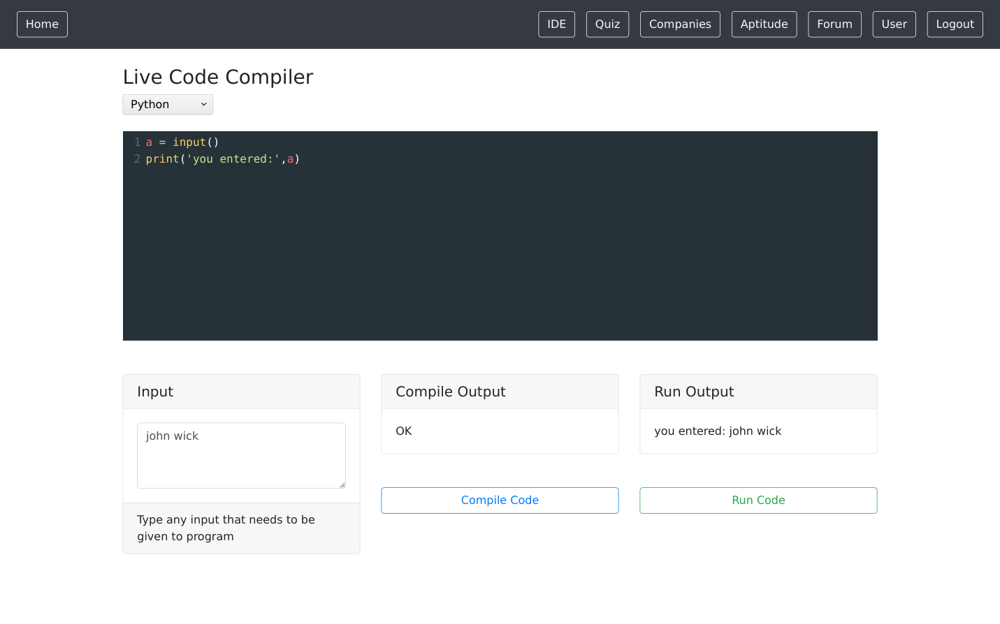

[]()
[](https://github.com/vijethph/PlacementCell/issues)
[](https://github.com/vijethph/PlacementCell/graphs/contributors)
[](https://github.com/vijethph/PlacementCell/network)
[](https://github.com/vijethph/PlacementCell/stargazers)
[](https://github.com/vijethph/PlacementCell/blob/master/LICENSE)
[](https://reactjs.org)
[](https://forthebadge.com)
[](https://forthebadge.com)

<br />
<p align="center">
  <a href="https://github.com/vijethph/PlacementCell">
    
  </a>

  <h2 align="center">Placement Cell</h2>

  <p align="center">
    A MERN Stack App that provides a recruitment preparation portal for students.
    <br />
    <br />
    <a href="https://github.com/vijethph/PlacementCell/issues">Report Bug</a>
    ·
    <a href="https://github.com/vijethph/PlacementCell/issues">Request Feature</a>
    .
    <a href="https://github.com/vijethph/PlacementCell/pulls">Send a Pull Request</a>
  </p>
</p>

<!-- TABLE OF CONTENTS -->

## Table of Contents

- [About the Project](#about-the-project)
  - [Built With](#built-with)
- [Getting Started](#getting-started)
  - [Prerequisites](#prerequisites)
  - [Installation](#installation)
- [Usage](#usage)
- [Contributing](#contributing)
- [License](#license)
- [Contact](#contact)
- [Acknowledgements](#acknowledgements)

<!-- ABOUT THE PROJECT -->

## About The Project

 
 

This is React app that uses [MongoDB](https://www.mongodb.com), [Express Framework](https://expressjs.com), [Node.js](https://nodejs.org/en) and [React Framework](https://reactjs.org) to provide a company recruitment preparation platform for students. It has features like discussion forum, quiz portal, aptitude practice videos and dashboard for latest placement updates from companies, to help students prepare for company recruitment drives. It also makes use of [HackerEarth API](https://www.hackerearth.com/docs/wiki/developers/v3/) to simulate a functional online code compiler with support for C, C++, Java and Python Languages.

### Built With

This project is entirely built with the following components and languages:

- [MongoDB](https://www.mongodb.com)
- [Express Framework](https://expressjs.com/)
- [React Framework](https://reactjs.org)
- [Node.js Runtime](https://nodejs.org/en)
- [HackerEarth API](https://www.hackerearth.com/docs/wiki/developers/v3/)

<!-- GETTING STARTED -->

## Getting Started

Follow these instructions in order to get a copy of the project up and running on your local machine for development and testing purposes.

### Prerequisites

Node.js>=10 and MongoDB>=4.2 should be installed. After installation, check Node.js version, and MongoDB daemon status using

```sh
node --version
service mongod status
```

### Installation

1. Clone the repo

```git
git clone https://github.com/vijethph/PlacementCell.git
```

2. Open the downloaded folder

```sh
cd PlacementCell
```

3. Modify the MongoDB URI in `server.js` file as per your DB configuration. Sign up for HackerEarth, retrieve an API key, and place it in `IDE.js` file inside `client/src/components` folder. Then import the required dependencies in project folder and `client` folders using

```sh
npm install
```

4. Run the program using

```sh
npm run dev
```

The app should be running in `http://localhost:3000` in your browser.

<!-- USAGE EXAMPLES -->

## Usage

Once the app starts, you can create an account in `Register` page, and then login as student to find the various features of this project. Optionally, you can import the companies details using the MongoDB dump named `dump.zip` in project folder, using the command `mongorestore dump`. You can watch practice videos, have some discussion with your peers, and test yourself in quiz.

You can also use the code compiler and try to improve your programming skills. You can view the recruitment updates of companies in `Companies` dashboard.

<!-- CONTRIBUTING -->

## Contributing [](https://github.com/vijethph/PlacementCell/pulls)

Contributions are what make the open source community such an amazing place to be learn, inspire, and create. Any contributions you make are **greatly appreciated**.

1. Fork the Project
2. Create your Feature Branch (`git checkout -b feature/AmazingFeature`)
3. Commit your Changes (`git commit -m 'Add some AmazingFeature'`)
4. Push to the Branch (`git push origin feature/AmazingFeature`)
5. Open a Pull Request

<!-- LICENSE -->

## License

Distributed under the MIT License. See `LICENSE` for more information.

<!-- CONTACT -->

## Contact

Vijeth P H - [@vijethph](https://github.com/vijethph)

Sathya M - [@sathya5278](https://github.com/sathya5278)

Project Link: [https://github.com/vijethph/PlacementCell](https://github.com/vijethph/PlacementCell)

## Thank You!

[](https://forthebadge.com)

If you like this project, please ⭐ this repo and share it with others 👍

<!-- ACKNOWLEDGEMENTS -->

## Acknowledgements

- [MongoDB Docs](https://docs.mongodb.com/)
- [React Framework Docs](https://reactjs.org)
- [Express Framework Docs](https://expressjs.com)
- [HackerEarth API Docs](https://www.hackerearth.com/docs/wiki/developers/v3/)
